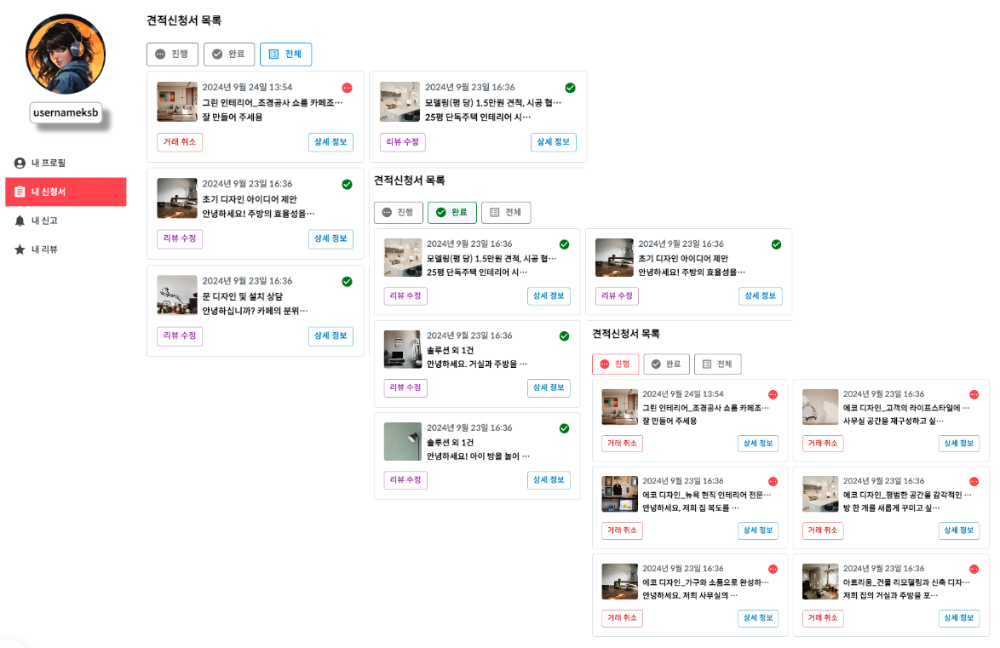
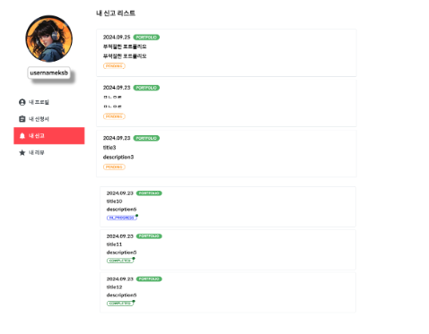
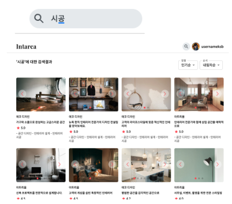
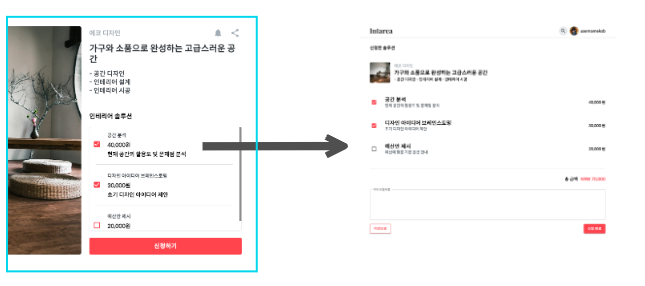
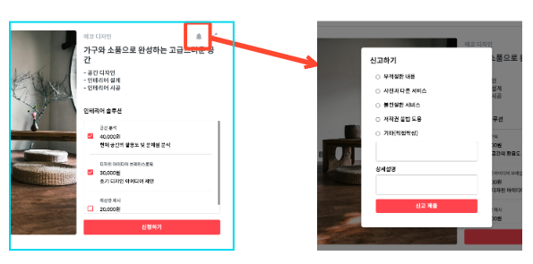
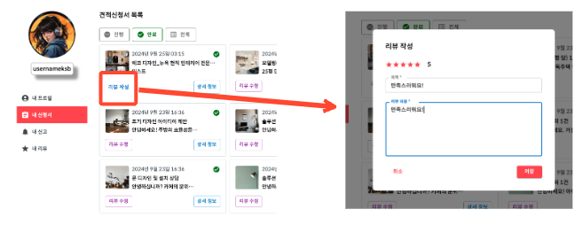

# IntArea
###  배포 주소: https://intarea.store

## 프로젝트 정보

### ■ 주제

- **인테리어 중개 플랫폼**  
'판매자'는 자신이 할 수 있는 인테리어 시공 기술을 포트폴리오로 정리하여 개시한다.  
'사용자'는 여러 포트폴리오를 둘러보고 자신이 원하는 업체에게 견적 신청을 한다.

### ■ 개발 환경

- 언어: Java 17, JavaScript
- DB: PostgreSQL
- 개발도구: IntelliJ, VS Code, DBeaver, Spring Boot, React
- 기타 S/W: ERD Cloud, Postman, Slack, GitHub, Docker

### ■ 팀원 구성 및 담당 업무

- 개발 인원: 5명
- 개발 기간: 37일(8/20 ~ 9/25)
- **담당 업무(김상빈): 헤더, 마이페이지, 검색, 견적 신청서, 신고, 리뷰**

## 결과 화면

### ■ 헤더

### ■ 마이 페이지

#### ■ 내 프로필

#### ■ 내 신청서

#### ■ 내 신고

#### ■ 내 리뷰

### ■ 검색

### ■ 견적 신청서

### ■ 신고

### ■ 리뷰

